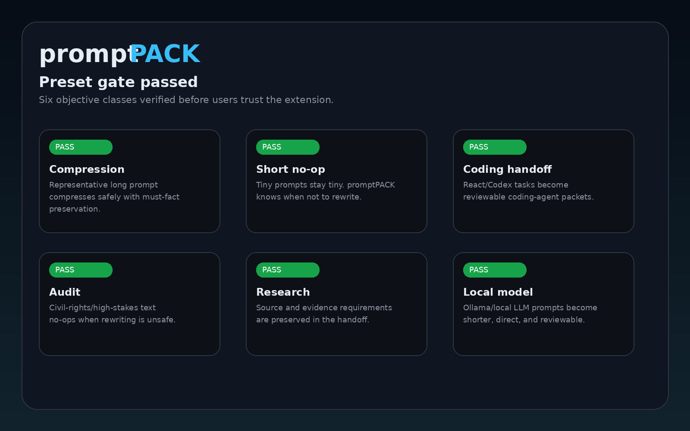

<p align="center">
  
</p>

<h1 align="center">promptPACK</h1>

<p align="center"><strong>Compress the prompt. Preserve the point.</strong></p>

<p align="center">Local-first Chrome extension for objective-aware prompt compression, no-op detection, must-fact preservation, and human-in-the-loop prompt handoff.</p>

<p align="center">
  
  
  
  
  
</p>

<p align="center">
  
</p>

## Why promptPACK exists

Most prompt tools rewrite everything.

promptPACK takes a more careful approach. It checks what the user is trying to do, then chooses whether to compress the prompt, leave it alone, convert it into a structured handoff packet, or route the result to human review.

It is designed around restraint: if rewriting would lose important context, no-op is a valid answer.

## What it does

| Objective | Behavior |
|---|---|
| Token compression | Produces a compact prompt when safe |
| Short prompt | No-op instead of bloating |
| Coding handoff | Builds a compact coding-agent packet |
| Research handoff | Preserves source/citation requirements |
| Local model handoff | Makes shorter, direct local-LLM prompts |
| Audit/high-stakes | Keeps original when rewriting is unsafe |

## Trust model

promptPACK is local-first in the current prototype.

- No network calls
- No remote code
- No analytics
- No automatic scraping
- No automatic insertion
- No automatic sending or publishing
- Selected text is read only after user action
- Insertion happens only after user action

See `docs/security/THREAT_MODEL.md`, `docs/security/DATA_FLOW.md`, and `docs/DECISION_ROUTING.md`.

## Install locally

1. Download or clone this repository.
2. Open Chrome and go to `chrome://extensions`.
3. Enable Developer mode.
4. Click Load unpacked.
5. Select the repository folder or the unzipped extension-only package.
6. Open promptPACK.
7. Run Preset Tests → Run all.

Expected:

```txt
PASS 6 / WARN 0 / FAIL 0
```

## Keyboard shortcuts (sidepanel)

Tab order follows the visual layout: **Use selected text → Analyze → Compress → Compare Modes → Objective → Target → Aggression → Input → preservation fields → Output → Copy / Insert**.

| Shortcut | Action |
|----------|--------|
| `Alt+C` | Compress / optimize |
| `Alt+A` | Analyze objective |
| `Alt+S` | Use selected text from active page |
| `Tab` / `Shift+Tab` | Move focus through controls in DOM order |

## Development

```bash
npm install
npm run commercial:gate
```

The commercial gate runs CI, extension packaging, manual QA artifact checks, and a static safety audit.

## Documentation

| Area | File |
|---|---|
| Architecture | `docs/ARCHITECTURE.md` |
| Methodology | `docs/METHODOLOGY.md` |
| Decision routing | `docs/DECISION_ROUTING.md` |
| Product brief | `docs/product/PRODUCT_BRIEF.md` |
| Threat model | `docs/security/THREAT_MODEL.md` |
| Chrome Web Store | `docs/chrome-web-store/STORE_RELEASE_CHECKLIST.md` |
| Launch assets | `docs/launch/LAUNCH_PLAN.md` |
| Open source governance | `docs/governance/OPEN_SOURCE_GOVERNANCE.md` |

## Open source

promptPACK is MIT licensed. The open-source core is designed to remain local-first. Any contribution that changes permissions, insertion behavior, network behavior, storage, or high-stakes routing requires extra review.

## Status

Commercial-grade open-source prototype / release candidate.

Not yet a polished Chrome Web Store production release.
