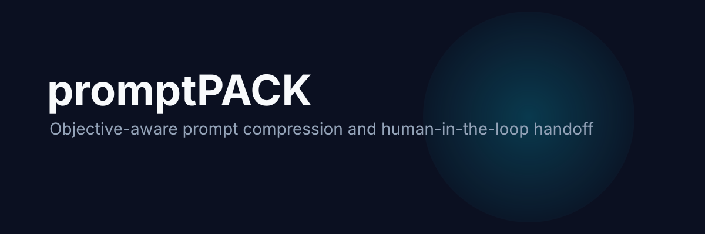

# promptPACK

<p align="center">
  
</p>

<p align="center">
  
</p>

<h3 align="center">Objective-aware prompt compression and human-in-the-loop handoff</h3>

<p align="center">A local-first Chrome extension that compresses prompts, preserves must-facts, and builds structured handoff packets only when you approve.</p>

<p align="center">
  <a href="https://lumenhelixlab.github.io/promptPACK/">Launch Page</a>
  <span> · </span>
  <a href="https://github.com/lumenhelixlab/promptPACK">GitHub</a>
  <span> · </span>
  <a href="https://lumenhelix.com">LumenHelix</a>
</p>

---

promptPACK is a local-first Chrome extension for objective-aware prompt compression. It inspects what the user is trying to accomplish, then compresses the prompt, leaves it untouched, or converts it into a structured handoff packet — always preserving must-facts and keeping the human in the loop.

## Why promptPACK

- **Stay accurate.** No-op and preservation gates prevent rewrite-induced information loss.
- **Stay private.** Everything runs locally; no data leaves your machine.
- **Stay in control.** Insertion and compression happen only after explicit user action.

## Quick start

### macOS / Linux

```bash
git clone https://github.com/lumenhelixlab/promptPACK.git
cd promptPACK
npm install
npm run ci
# Load repository folder as unpacked extension in chrome://extensions
```

### Windows (PowerShell)

```powershell
git clone https://github.com/lumenhelixlab/promptPACK.git
Set-Location promptPACK
npm install
npm run ci
# Load repository folder as unpacked extension in chrome://extensions
```

### Windows (Git Bash / WSL)

```bash
git clone https://github.com/lumenhelixlab/promptPACK.git
cd promptPACK
npm install
npm run ci
# Load repository folder as unpacked extension in chrome://extensions
```

> Tested on Windows 11, macOS Sonoma, Ubuntu 22.04/24.04, and modern mobile browsers.

## Features

| Feature | What it gives you |
|---------|-------------------|
| Objective-aware compression | Detects intent and picks token compression, no-op, or structured handoff accordingly. |
| Must-fact preservation | Locks critical facts so rewrites never drop the context that matters. |
| Local-first privacy | No network calls, no analytics, no remote code — your prompts stay in the browser. |
| Human-in-the-loop handoff | Builds compact coding, research, or local-LLM packets only when you approve. |

## Architecture

```
promptPACK/
├── manifest.json         MV3 manifest
├── src/
│   ├── sidepanel.html    Main UI
│   ├── sidepanel.js      Compression + handoff logic
│   ├── service_worker.js Background events
│   ├── content_script.js Page text selection
│   ├── options.html/js   Extension options
│   └── theme.css         UI styling
├── assets/               Icons, screenshots, logo
├── tests/                Preset and manifest smoke tests
└── scripts/              Packaging and audit tools
```

## Development

```bash
npm install
npm run commercial:gate
```

## Roadmap

- [ ] Chrome Web Store production release
- [ ] Custom compression presets
- [ ] Export/import handoff packets

## License

Released under the MIT License.

---

<p align="center">
  <sub>promptPACK is a <a href="https://lumenhelix.com">LumenHelix</a> project — Applied Symbolic Dynamics & Reversible Computation.</sub>
</p>
